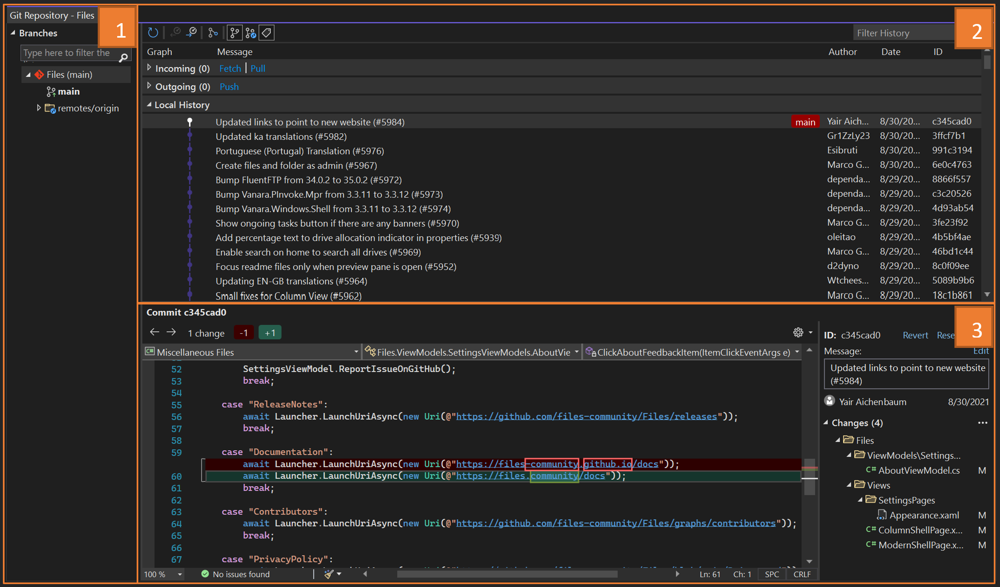

# Viewing Your Revision History in Visual Studio
In this lesson, we will learn how to look at all the different versions, or snapshots of the project over time in Visual Studio. These snapshots are called commits.

## Using the Git Repository Window
As mentioned previously, cloning a Git repository creates a local repository copy on your machine. Let’s start by using Visual Studio to explore the local repository we created last time when cloning this project. To do that go to “View > Git Repository” which opens the following Git Repository window. 
 

The Git repository window contains 3 main sections:
1- Branches: Git empowers users to multi-task and experiment with their code through branches. If you are working on multiple features at the same time or if you would like to explore ideas without effecting your working code, branching can be very helpful. We haven’t created any branches in this repository so the only local branch that shows is “main” which is created automatically by Git when you first clone. If you expand the remotes/origin folder, you will see a list of the remote branches that the Files team is working on. 

2- Git Graph: The Git graph section visualizes the state of your branch. It has three different sections: incoming, outgoing and local history. The incoming section shows incoming commits that your team has been contributing, the outgoing section shows your local commits that you still haven’t pushed, and the local history shows the rest of commits tracked by your local repository.

3- Commit Details: clicking any commit on the Git Graph section opens the commit details UI showing the details of commits. You can check the changes introduced by commits by clicking on them which would show a difference. For example, on the previous screenshot you can see that we are viewing one of the changes that has been introduced to the AboutViewModel.cs file. 

## 🚨 Challenge - Navigate the repository to find a specific commit

| Challenge  | Solution   | Duration   | What you will learn |
| ------------------------------- | ------------------------------- | ----------- | ----------- |
| Find the hidden message in Commit ID 93e6b07b952a44f5461a20882fa625003e6b0ba0 | [Verify](images/answer3.png) | 3 min |  How to filter in the Git Repository window | 

## What’s next?
Now that you know how to navigate the repository, you can revert to previous commits and learn advanced Git topics like cherry-picking! Check the links below to learn more:
*	[Revert changes | Microsoft Learn](https://learn.microsoft.com/en-us/visualstudio/version-control/git-manage-repository?view=vs-2022#revert-changes)
*	[Copy commits (cherry-pick) | Microsoft Learn](https://learn.microsoft.com/en-us/visualstudio/version-control/git-manage-repository?view=vs-2022#copy-commits-cherry-pick)
