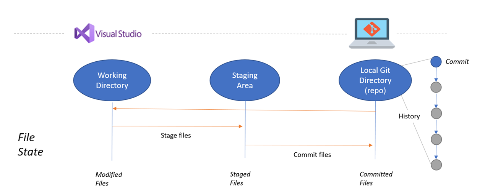
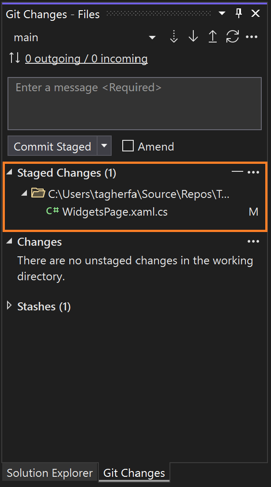
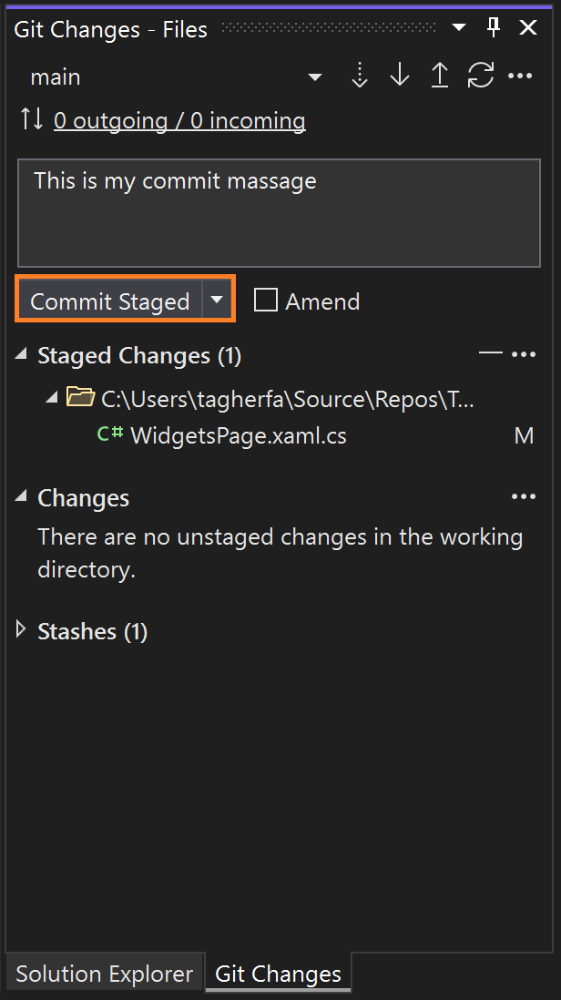

# Daily Workflow with GitHub in Visual Studio and Next Steps 
In this lesson, we will learn how all the previous lessons come together in practice with the development innerloop workflow.

## Staging and Committing 
We talked about how to view your Git repository in Visual Studio (Committed Files), but we haven’t talked about how to commit your changes. Git has the following three main states that files can reside in:
*	Committed: files in your Git directory which are a part of your repository History
*	Staged: modified files added to the staging area in preparation for committing
*	Modified: modified files that haven’t been staged or committed to your repository

Staging files before committing them is an optional step that you might want to utilize to prepare for a commit. That way you can only commit the files that are ready to be committed (Staged).

   
    
In Visual Studio all of your modified files can be found in the Git Changes window next to Solution Explorer (view > Git Changes). You will find your modified files under the changes section. You can commit your changes right away by providing a commit message and clicking the Commit All button. Alternativly, you can chose to stage the changes that you would like to commit first using the + button. Staging can be usefull if you need to commit a subset of your changes. Once you click the commit button, you get a confirmation message and your outgoing commits status changes to 1. To view the commit you have just made, click the outgoing/incoming link which will take you the the Git Repository window. 

## Pushing and Pulling
Pushing is the last step once you’ve committed your staged changes. This uploads your local commits to the remote repository.

Before you start a coding session, always make sure you have the most recent version of your code from your remote repository by using Fetch, Pull, or Sync. Fetching checks if there are any remote commits that you should incorporate into your local changes, pulling adds those commits to your local repo, and syncing does a Pull operation, then a Push operation.

Learn more [here](https://learn.microsoft.com/en-us/visualstudio/version-control/git-fetch-pull-sync?view=vs-2022).

## 🚨 Challenge - Make your first commit in your repo

| Challenge  | Solution   | Duration   | What you will learn | More information |
| ------------------------------- | ------------------------------- | ----------- |  -------------------------------------- |
| Make a change in your new repo from last lesson, and stage, commit, and push it!	| [Verify](images/answer5.png) | 3 min |  How to add commits to your remote repo | [Make a Git commit](https://learn.microsoft.com/en-us/visualstudio/version-control/git-make-commit?view=vs-2022) |

## What’s next?
Now that you know how to make commits, you can learn more advanced Git topics staging lines of code,  amending commits, and handling merge conflicts! Check the links below to learn more:
*	[Stage lines of code in Visual Studio | Microsoft Learn](https://learn.microsoft.com/en-us/visualstudio/version-control/git-line-staging?view=vs-2022)
*	[Change the last commit | Microsoft Learn](https://learn.microsoft.com/en-us/visualstudio/version-control/git-manage-repository?view=vs-2022#change-the-last-commit-amend)
*	[Resolve merge conflicts in Visual Studio | Microsoft Learn](https://learn.microsoft.com/en-us/visualstudio/version-control/git-resolve-conflicts?view=vs-2022)

## How’d it go?
You’ve reached the end of this learning series, please take this quick, 10 question [survey]() to give us your thoughts on this series and what you’d like to see from us next!
